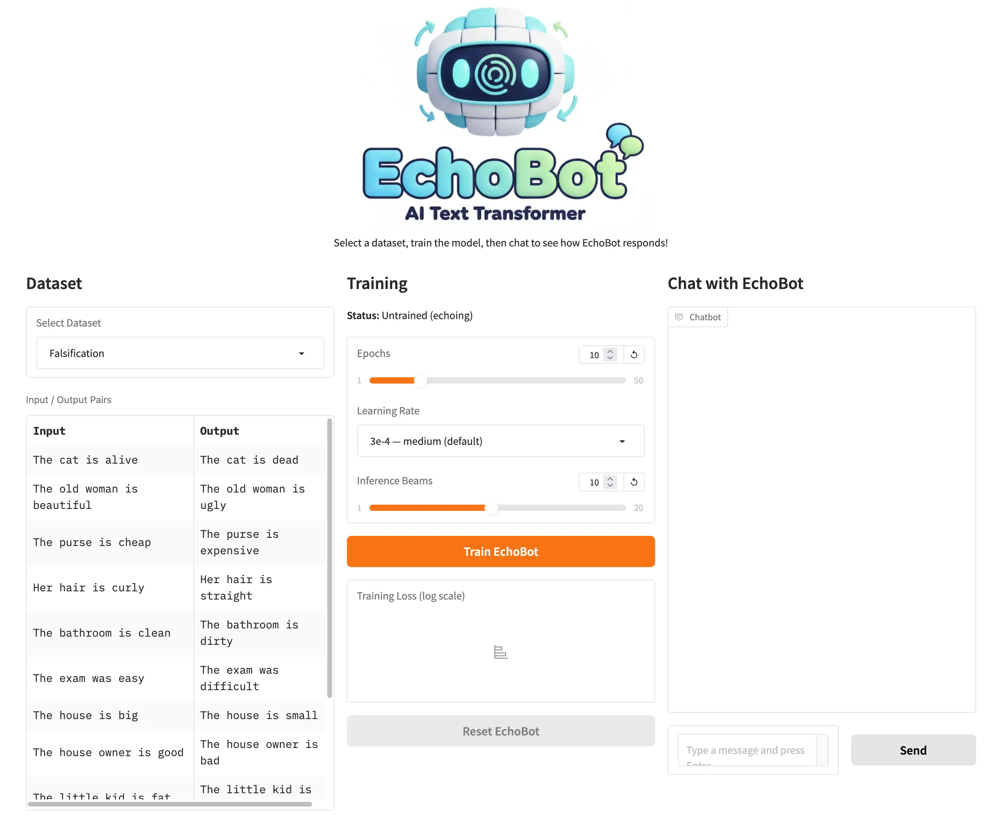
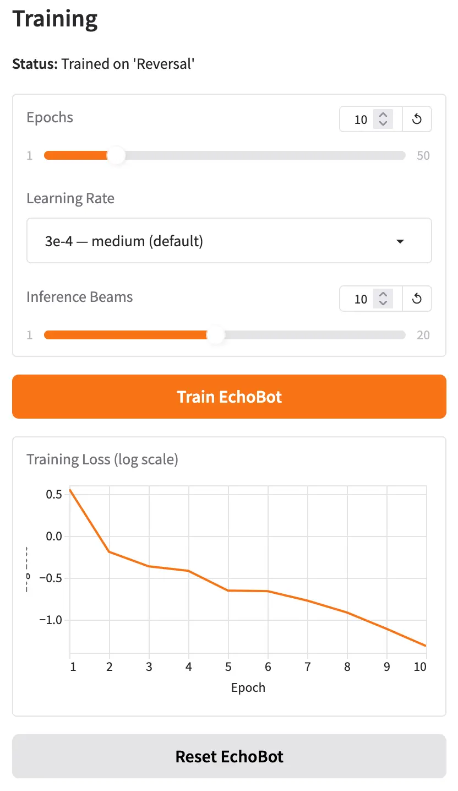
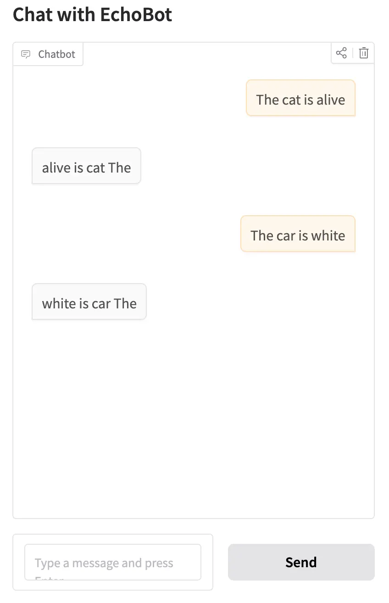

As students learn more about Generative AI, one important topic for them to understand is the ability to take a pretrained model and adapt it for a new style or domain, i.e. fine-tuning.

Teaching fine-tuning, however, can be challenging. Not only is it a complex topic, but there is a significant compute barrier for students to work through. In my CS-394 undergraduate class on Generative AI, students fine-tune a small Qwen 3 1.7B LLM. Depending on the use case, this can require several thousand synthetic training examples and 45 minutes of compute time on a Google Colab A100 GPU.

In most cases, my undergrad students have access to Colab and the patience to sit through a 45-minute training run to see their results. For younger grades such as middle and high school, however, this is not a realistic option.

Working with Code.org, I wanted to explore whether there was a different approach that could teach younger students about fine-tuning. The goal was to get everything running on a much smaller GPU and take 45 seconds instead of 45 minutes. After iterating on different models and approaches, we came up with EchoBot.

# What is EchoBot?

EchoBot is a model that can be easily fine-tuned with small (few-shot) datasets without a lot of GPU overhead. It is designed to teach students how fine-tuning works, what's possible, and what its limitations are.

{fig-alt="A screenshot of EchoBot showing datasets, training parameters, and a chat window"}

In its untrained state, EchoBot simply echoes whatever is given to it. If you input `Hello, how are you?`, EchoBot will respond with `Hello, how are you?`

To make EchoBot more useful, students can train it with a dataset. The training dataset can be as small as 10–15 input/output sentence pairs that EchoBot should learn from. For example, if a student wanted to train EchoBot to falsify statements, they might create a training set like this:

```json
{"input": "The cat is alive", "output": "The cat is dead"}
{"input": "The old woman is beautiful", "output": "The old woman is ugly"}
{"input": "The purse is cheap", "output": "The purse is expensive"}
```

And so on for 10 or 15 examples.

With the dataset complete, students provide training parameters (or just run with the defaults) and click the "Train" button. Training takes about 25 seconds for 10 epochs, and students can monitor progress with a live training loss graph.

{fig-alt="A screenshot of a completed training run" fig-align="center" width="400px"}

Once training is complete, when students now chat with EchoBot, it should begin to generalize, correctly transforming inputs it saw during training and applying the same logic to examples it has never seen before.

{fig-alt="A screenshot of a chat window with two successful reversal tests" fig-align="center" width="400px"}

Once students are ready to experiment further, they can reset EchoBot to its untrained state, adjust the training parameters, select a different dataset, or try a different use case entirely.

## Training Parameters

There are three parameters students can experiment with: Epochs, Learning Rate, and Inference Beams.

**Epochs** is the number of times EchoBot sees the training data during a training run. Too few epochs and EchoBot doesn't learn enough from the data. Too many and it starts to overfit, becoming very good at transforming the examples in the training set but failing to generalize to new input. Overfitting is a key learning outcome for students to discover through experimentation.

**Learning Rate** specifies how aggressively EchoBot updates its internal weights during each training step. By adjusting the slider between "stable" and "aggressive," students can start to understand the interplay between learning rate, number of epochs, and the quality of generalization.

**Inference Beams** control how EchoBot searches for the best output when generating a response. Rather than always picking the most likely next word at each step, beam search maintains several candidate output sequences simultaneously and selects whichever scores highest overall. More beams can improve output quality, though students will notice slightly longer generation times as they increase the value.

## Training Datasets

EchoBot currently includes six training datasets for students to explore:

**Falsification:** Falsifies a statement. `The cat is alive` becomes `The cat is dead`.

This is a great starting dataset. The transformation is easy to understand, and students can immediately try their own creative inputs to test whether EchoBot has generalized.

**Reversal:** Reverses the words in a sentence. `The cat is alive` becomes `alive is cat The`.

This dataset opens up a great classroom discussion: when does AI make sense? Word reversal is trivially easy to accomplish with a few lines of code, so why would anyone train a neural network to do it?

**Statement-to-Question:** Rewrites a statement as a question. `The cat is alive` becomes `Is the cat alive?`

This builds naturally on the reversal discussion. Unlike simple reversal, converting a statement to a grammatically correct question involves real linguistic understanding, making it a much harder problem to solve with conventional code.

**Past to Present Tense:** `The cat meowed loudly` becomes `The cat meows loudly`.

This is one of my favorites. Tense conversion requires understanding verb forms, which gets genuinely interesting when you start thinking about how EchoBot might perform across different languages.

**Formalization:** `I'm gonna go to the store` becomes `I'm going to go to the store`.

This one is fun for students and also a natural entry point for introducing vector spaces: the word `gonna` sits very close to `going` in the model's embedding space, which is part of why this transformation works so well.

**Capitalizing Proper Nouns:** `he works for google in new york` becomes `He works for Google in New York`.

The final dataset offers a great discussion about where AI fits into everyday life. For example, students can understand how this might be embedded in a messaging app or document editor to silently clean up text as it's being typed.

## When EchoBot Doesn't Work

With a good dataset and well-tuned training parameters, students can quickly see how a fine-tuned model can generalize to inputs it has never encountered before.

When EchoBot fails, that failure can be just as instructive. Every dataset in EchoBot deliberately contains only single-sentence examples. If a student provides multi-sentence input, EchoBot will likely falter. For example, trained on the reversal dataset, the input `My house is blue. I also have a large garden.` will often produce `blue is house My`, reversing only the first sentence and ignoring the second entirely. This is a powerful prompt for a class discussion about why diversity and representativeness in training data matter so much.

Another interesting failure case is out-of-vocabulary words. With EchoBot trained on the proper nouns dataset, the input `my best friend is karim` will often return `My best friend is karim` — capitalizing the first word but missing the name. The reason is that "karim" is not a token the underlying model recognizes, while "john" is. This opens up a natural conversation about tokenization and how what a model "knows" is shaped by the text it was originally trained on.

# How does EchoBot Work?

EchoBot is built on **T5** (Text-to-Text Transfer Transformer), an encoder-decoder transformer model originally developed by Google. Unlike GPT-style models that generate text in a single left-to-right direction, T5 is designed to take a piece of text as input and produce a transformed piece of text as output, making it a natural fit for the kind of input-to-output transformation tasks EchoBot teaches.

When EchoBot first loads, it uses the pre-trained T5-Base weights, which encode general language knowledge learned from a large text corpus. In this state, the model is configured to simply repeat its input as output, hence the name EchoBot.

When a student trains EchoBot with a dataset, a fine-tuning process begins. For each input/output pair:

1. The input text is passed through T5's **encoder**, which builds an internal representation of the sentence's meaning.
2. The **decoder** uses that representation to generate output tokens one at a time.
3. The model's predicted output is compared to the expected output from the training pair, and an error (called **loss**) is calculated using cross-entropy.
4. The loss is propagated backwards through the network (**backpropagation**), and the model's weights are nudged in a direction that would reduce that error — a process managed by an optimizer called **AdamW**.

This cycle repeats across the entire dataset for as many epochs as the student specifies. Each pass through the data refines the weights a little more. After enough training, the model has internalized the transformation pattern and can apply it to sentences it has never seen before.

During inference (when a student types a new input after training) EchoBot uses **beam search** to produce its output. Rather than committing to the single most likely word at each generation step, beam search maintains several candidate output sequences (the "beams") in parallel. At every step, each beam is extended with its most probable next token, and the lowest-scoring candidates are pruned. When all beams have completed, the highest-scoring sequence is returned as the final output. This approach is more likely to find a globally good sequence than greedy word-by-word selection, especially for short transformation tasks like those in EchoBot.

# Can I Try EchoBot?

Yes! EchoBot is hosted on a Hugging Face Space here: https://huggingface.co/spaces/simonguest/echobot. You can also click on the "Files" tab to investigate the source code.

It uses Hugging Face's ZeroGPU architecture to dynamically allocate a GPU on demand, so your mileage may vary if a large number of students try to access it simultaneously.

# Future Thoughts

It's been a lot of fun building EchoBot and seeing the initial reactions.

There are a couple of small features I plan to add soon, including the ability to import and edit datasets directly in the UI, but for now I'd love to gather as much feedback as possible.

I'll be using EchoBot at a summer camp later this year, but I'd especially love to hear from others who have tried this in a student setting. What worked? What didn't? And what would you like to see changed?