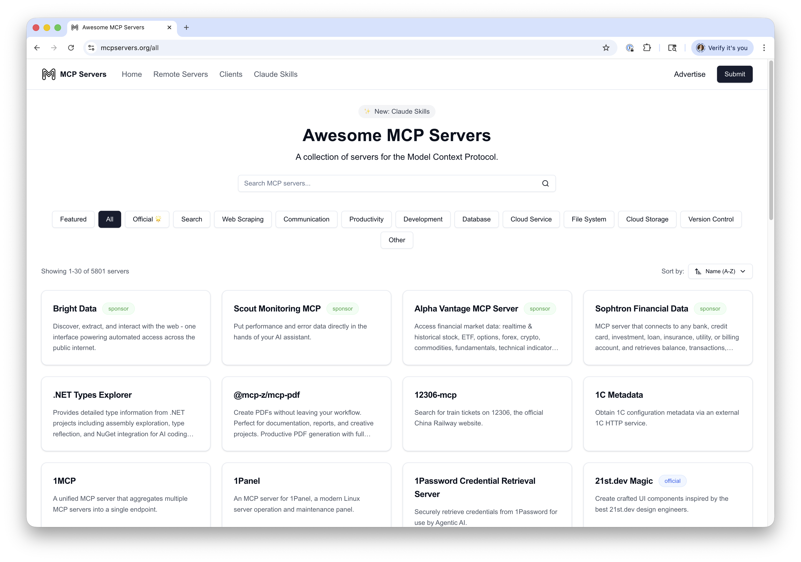
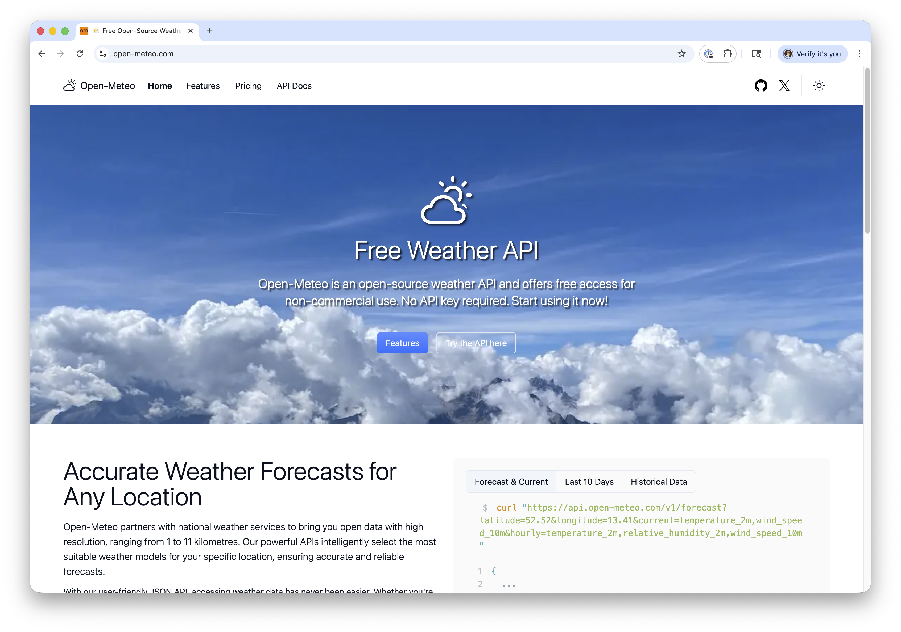
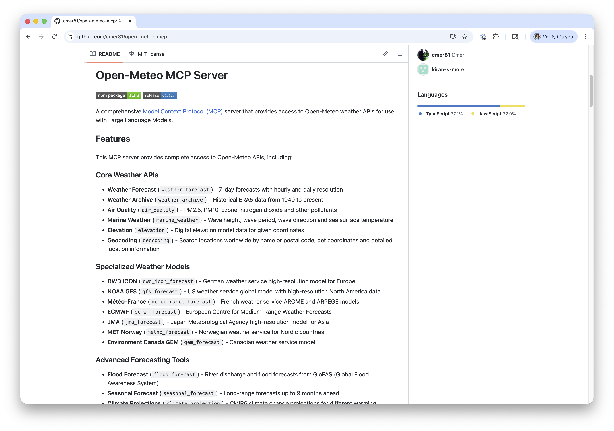

## Introduction

- Simon Guest
- CS and AI Educator
- Adjunct Professor of AI at DigiPen
- Technical Advisor and Former CTO at Code.org
- 25+ Years Shipping Software for Microsoft, Amazon, SAP, IBM, and others

## Agenda

- **Architecting for Generative AI**
  - Best practices for using LLM APIs
  - Hosted, closed models vs. local, open-source models
  - Agents: SDKs and tools
- **AI Coding Best Practices**
  - Scaffolding new repos for coding agents
  - Coding agent best practices
  - Future: Local coding models

# Discussion Encouraged!

# Architecting for Generative AI

# Best Practices for LLM APIs

## OpenAI Chat Completions API

- 2020: OpenAI launched GPT-3 API with a `/completions` endpoint.
  - First major LLM API
- 2022: ChatGPT launch; massive adoption
- 2023 `/chat/completions` endpoint released, becomes the dominant interface
- 2023-2024: Other providers use the same API format for their own models vs. inventing their own
  - Build on the OpenAI developer ecosystem
  - "OpenAI-compatible" became a selling point

## OpenAI Chat Completions API

- Who uses the OpenAI Chat Completions API format?
  - Anthropic (Claude API is very similar, with minor differences)
  - OpenRouter, an inference provider for many models
  - Open source tools: LiteLLM, LangChain
  - Local serving: Ollama, vLLM, llama.cpp are all "OpenAI-compatible"

## Using the Chat Completions API



## Using the Chat Completions API



## Using the Chat Completions API



## Chat History Management

- Key Considerations
  - Models don't hold any state
  - API sends **full** conversation on every request and the model reads through the full conversation on every call
  - The size of the conversation is known as the context
  - The maximum size the model can process is referred to as the **context window**

## Chat History Management

- Context window sizes
  - GPT-2 = 2048 tokens
  - Today's nano models ~= 32k tokens
  - Today's small models ~= 120k tokens
  - Today's frontier models ~= 1M tokens
- Large conversations can cause challenges
  - They are expensive (you pay per token for whole conversation every time)
  - Small models often forget early details in long conversation histories

## Chat History Management

- Mitigation Strategies
  - Remove older messages from the history
  - Implement sliding window across the conversation history
  - Summarize older messages and rewrite the history (compacting)

## Token Streaming

- When calling hosted models, responses can take a few seconds to be returned
  - Not the best user experience, especially for consumer products
- Need a way to support streaming of tokens as they are generated (a.k.a. "typewriter effect")
  - Streaming added to Chat Completions API in early 2023
  - Supported by other major vendors (Anthropic, Cohere, etc.)
  - Now expected as a baseline feature

## How Does Token Streaming Work?

- Uses SSE (Server-Sent Events)
  - Unidirectional (server to client)
  - Uses standard HTTP/1.1 or HTTP/2
  - Server sends a response with a `text/event-stream` MIME type
  - Client uses built-in `EventSource` API to open the connection, listen to messages, and handle events.

## SSE Data Format

```
data: {"choices":[{"delta":{"content":"Hello"}}]}

data: {"choices":[{"delta":{"content":" world"}}]}
  
data: [DONE]
```

Data sent as chunks, prefixed with `data:` and separated by double newlines

## Implementing Token Streaming



## Structured Output

- By design, LLMs generate non-structured output (i.e., free-form text)
- Sometimes, paragraph. Sometimes, numbered list.
- *"What are the GPS coordinates for Paris"*
  - *"48.8566, 2.3522"*
  - *"You can find Paris at lat: 48.8566 long: 2.3522"*
  - *"The GPS coordinates of Paris are 48.8566 and 2.3522"*
- But often, you need structure - e.g., a JSON object

## Structured Output

- You can try to use the system prompt
  - "Return the result in JSON only"
- But... it doesn't always work
  - Early/small models struggle with correct JSON formatting
  - Even larger models make mistakes (e.g., missing closing brace)
- Sometimes the models just forget!
  - "RETURN THE RESULT IN JSON ONLY. NO OTHER TEXT!!!"

## Structured Outputs in OpenAI API

- Nov 2023: OpenAI added JSON mode
  - `response_format: {"type": "json_object"}`
  - Guaranteed valid JSON, but didn't enforce schema
  - Sometimes mixed up/missed fields
- Aug 2024: **Structured Outputs** launched
  - `response_format: {"type": "json_object", ...}`
  - 100% reliability that output matches the your schema

## How Structured Outputs Work

- Constrained Decoding
  - When generating responses, the model normally samples from all possible next tokens
  - With **constrained decoding**, the next token is **dynamically filtered** to only allow tokens that keep the output schema valid
    - e.g., if schema requires an integer, string tokens are masked out from the probability distribution

## How Structured Outputs Work

- Runs on server (or in library) - not fine-tuning approach
- Slightly slower token generation due to computational overhead
- Technically, it's mathematically impossible to generate invalid output
  - (Real world: I see ~1:7000 error rates with GPT-5.1 chat)

## Implementing Structured Outputs



## Implementing Structured Outputs



## Implementing Structured Outputs



# Q&A

# Hosted, Closed Models vs. Local, Open-Source Models

## Why Local AI?

- **Privacy**
  - Every call to ChatGPT or Claude may get logged and/or be used for training purposes
  - Many organizations don't want their customer/financial data logged with an AI vendor
  - There may also be legal regulations/restrictions

## Why Local AI?

- **Offline**
  - Every call you make to ChatGPT or Claude needs an Internet connection
  - That's not always guaranteed!
  - e..g, a remote school in India and/or on a plane with no WiFi

## Why Local AI?

- **Latency**
  - Even with a network connection, calls can suffer from increased latency
  - Especially if your application needs frequent, quick responses
  - e.g., using a VLM on a video stream for a user with vision impairments

## Why Local AI?

- **Cost**
  - While per-API costs are fractions of a cent, these can grow out of control with exponential growth
  - More pronounced for long conversation threads
  - Or agents with verbose tool call requests/responses

## Closed vs. Open-Source Models

- **Closed Source:** 
  - OpenAI GPT-5, Claude Sonnet/Opus, Google's Gemini
  - Very large models; often referred to as **foundational** models or **frontier** models
  - Hosted by the vendors
  - No ability to download the models
  - No ability to inspect the weights of the models

## Closed vs. Open-Source Models

- **Open Weight:** 
  - Meta's Llama, Google's Gemma, Alibaba's Qwen, OpenAI gpt-oss-120b 
  - Range from small to medium in size (1Gb - 500Gb+)
  - Downloadable model files
  - Model files are pre-trained weights, but no training data
  - No training data == No ability to recreate the model from scratch

## Closed vs. Open-Source Models

- **Open Source:** 
  - You can download the model files with pre-trained weights **and** the training data used to train it
  - i.e., you could create the model from scratch
  - Examples: AI2's OLMo, NVIDIA Nemotron

## Introducing Quantization

- Roughly speaking, the size of the model file dictates how much VRAM (or unified memory) you need
  - 55Gb model ~= 55Gb of VRAM
- What if we don't have that much?

## Introducing Quantization

- Two ways to shrink a model:
  - Reduce the number of weights
  - Reduce the precision of the weights (quantization)
- Number of weights matters more than precision
  - A 70B model at 4-bit will often beat a 13B model at 32-bit
  - The model's knowledge remains largely intact

## Quantization Formats

- GGUF (GPT-Generated Unified Format):
  - Runs on all platforms (NVIDIA, AMD, Apple)
  - unsloth community on HF hosts quantized versions of popular models
  - Multiple quantization schemes (Q4_K_M, Q5_K_S, Q6_K, etc.)

## Quantization Formats

- MLX:
  - Apple-only
  - Offers better performance on Mac (compared to GGUF)
  - mlx-community on HF hosts MLX-quantized versions of popular models
  - 4bit and 8bit support

# Demo

LM Studio running google/gemma-3-27b

# Q&A

# Agents: SDKs and Tools

## Why Agents?

- Limitations of chatbots
  - Needs constant human input every turn; No ability to plan beyond a single interaction
  - Single model with single context (conversation)
  - No ability to interact with external systems

## Five Characteristics of Agents

1. Agents are **Planners**

- Agents are driven by goals
- And they can put together a plan for the steps to complete that goal.
  - "First, I will discover where course information is located"
  - "Then I will search for any courses that reference FLM201"
  - "Then I summarize all of the key points for the student"

## Five Characteristics of Agents

2. Agents are **Autonomous**

- Agents can then go off and execute the plan, independent of human input
- The concept of "human in the loop" still applies for confirmation
  - e.g. "Do you really want to place this order?"

## Five Characteristics of Agents

3. Agents are **Reactive**

- Agents can change mid-course depending on what they find and/or the environment.
  - e.g. "I couldn't find any course information on FLM201. I'm going to check if there are other 200-level FLM courses before responding to the student."

## Five Characteristics of Agents

4. Agents have **Persistence**

- Agents often have memory systems beyond the current conversation
- Broadly classified as short and long-term memory 
  - Short-term memory could be your order request at the Bytes cafe
  - Long-term memory could be your food preferences

## Five Characteristics of Agents

5. Agents can **Interact** with external systems

- Agents can **delegate** to other agents for complex tasks
  - (Or for tasks where other agents are better suited for.)
  - e.g., Campus Agent -> delegating to a Course Agent
- Agents can also be given access to external **tools**
  - e.g., File search, Web search, access to the Bytes Cafe API

## OpenAI Agents SDK

- [Announced](https://openai.com/index/new-tools-for-building-agents/){.external target="_blank"} in Mar 2025
  - Together with web search, file search, and computer use
  - And a new Responses API (formerly Assistants API)

## OpenAI Agents SDK

- Created to address the gap between chat completions (what we were using last week) and multi-step systems
  - vs. building your own, which a lot of developers were doing at the time
- Integrates function calling, handoffs, and session management in the same package
- Supports Python and TypeScript; MIT licensed

## Not the only Agent SDK in town!


## LangGraph 
- https://langchain-ai.github.io/langgraph/
- Python only
- MIT License
- One of the first agent frameworks, building on LangChain
  - IMO, too abstract/complex/bloated

## Crew.ai

- https://github.com/crewaiinc/crewai
- Python only
- One of the more popular commercial offerings
  - (Although they do have an MIT License/freemium model)

## Microsoft 

- AutoGen
  - https://microsoft.github.io/autogen/stable/
  - Python (.NET coming soon)
  - MIT License
- Microsoft Semantic Kernel
  - https://github.com/microsoft/semantic-kernel
  - Python, .NET, Java
  - MIT License

## Hermes

- TBD

## pi.dev

- TBD
- Core engine of OpenClaw

## Why Do Agents Need Tools?

- The scope of the agent's ability is contained within the model
- Tools enable the agent to reach out to systems beyond the model
- Examples
  - Read a file from disk or search the web (built in)
  - Calculator (because LLMs aren't great at math)
  - Code interpreter (running code on the fly)

## OpenAI Tool Calling

- Introduced by OpenAI in June 2023
- Originally called Function Calling
- Models are fine-tuned to return a structured function_call JSON object, specifying which function to call and with what arguments.
- Tools are provided as functions
- Option for the LLM to decide when to call the tool (always, never, auto)

## Beyond Tool Calling

- Tool calling is super useful, but...
  - You need to write the function(s) yourself
  - And then expose them to OpenAI using the `@function_tool` method
- What if there was a way to standardize this?

## MCP (Model Context Protocol)

- Released by Anthropic in Nov 2024
- Provides a standard interface for tools - akin to a USB standard for peripherals
- Implementations are known as "MCP servers"
  - A server exposes one or more tools (functions)
  - Uses JSON-RPC 2.0 as underlying RPC protocol
  - Servers can run remotely over HTTP (supports SSE)
  - Or can be hosted locally and accessed via stdio
  - Many servers hosted using Node.js

## MCP (Model Context Protocol)

{.lightbox}

## MCP (Model Context Protocol)

{.lightbox}

## MCP (Model Context Protocol)

{.lightbox}

# Q&A

# AI Coding Best Practices

## A Brief History

- TBD: History / just autocomplete
- TBD: Early agents / Context limit problem
- TBD: Then more complex agents (harnesses): Copilot, Cursor,
- TBD: Now, less about the model and more about the harness

## Scaffolding New Repos

- TBD: Two camps: "Hands-Off / Vibe-coding" vs. "Hands-On / Powertool"
- TBD: Hands off can be tempting
  - Create an issue in GitHub, send an agent to work on it, direct from your mobile phone
  - But, IMO lose control of the architecture
  - Analogy to the Winchester Mystery House
- TBD: Prefer Powertool approach (what I recommend to my students)
  - Hand-build the architecture / frame out the house
  - Then use AI to fill in the details
- TBD: CLAUDE.md should describe the architecture of the system (house frame)
- TBD: SKILL.md should describe each area (room)

## Coding Agent Best Practices

- TBD: Plan, Act, Test,(Abort), Commit, Clear

## Coding Agent Best Practices

- **Plan**
  - Write the specification for the feature
  - Be descriptive, bullet points help
  - Ask the agent to validate/question the approach
  - *"What questions and/or clarifications do you have?"*
  - Push back on things that seem incorrect

## Coding Agent Best Practices

- **Act**
  - Once happy with the specification, implement
  - Watch carefully for file changes/updates
  - Correct approach mid-stream
  - *"I think there's a 3rd party library for that..."*

## Coding Agent Best Practices

- **Test**
  - Test the feature locally / manually
  - Build a complete test suite
  - (Agents are really good at writing tests)
  - Have the agent run it's own tests after the feature

## Coding Agent Best Practices

- **Abort**
  - Sometimes, things don't work as expected!
  - It can be challenging to fix before exhausting the context window
  - And Claude Code will "spin out of control"
  - `git stash`, clear context (new session), update the feature spec, and restart

## Coding Agent Best Practices

- **Commit**
  - Before committing to source control, have Claude self-update CLAUDE.md and create skills (if major new functionality)
  - Review CLAUDE.md file often
  - Auto-compact if approaching ~40K

## Coding Agent Best Practices

- **Clear**
  - Once CLAUDE.md and feature is committed, clear context (`/new` in Claude Code)
  - Analogy: 50 First Dates movie

## Future: Local Coding Models?

- **OpenCode** is an open-source, terminal-based AI coding agent
  - Runs entirely locally using any OpenAI-compatible API server (e.g., LM Studio)
  - Reads and edits files, runs shell commands, and iterates on code
- **Model-agnostic** Swap in any local model (Qwen, DeepSeek, Llama, etc.) via a config file

# Demo

OpenCode running with local model

## Qwen3.5 vs Frontier Models

| Benchmark | Qwen3.5-27B | GPT-5-mini | GPT-OSS-120B |
|---|---|---|---|
| MMLU-Pro | 86.1% | 83.7% | 80.8% |
| GPQA Diamond | **85.5%** | 82.8% | 80.1% |
| SWE-bench Verified | **72.4%** | 72.0% | 62.0% |
| LiveCodeBench v6 | 80.7% | 80.5% | **82.7%** |

## Gemma 4 vs Frontier Models

| Benchmark | Gemma 4 31B | Gemini 2.5 Pro | Claude 4 Opus |
|---|---|---|---|
| MMLU-Pro | 85.2% | — | — |
| GPQA Diamond | **84.3%** | **86.4%** | 79.6% |
| LiveCodeBench v6 | 80.0% | 72.5% | 48.9% |
| AIME 2026 | 89.2% | — | — |

## Qwen3 Coding vs SOTA (SWE-bench)

| Model | SWE-bench Verified | Open? |
|---|---|---|
| Claude Opus 4.5 | 77.8% | No |
| Qwen3.5-27B | 72.4% | Yes |
| Claude Sonnet 4 | 70.4% | No |
| Qwen3-Coder (480B) | 69.6% | Yes |
| GPT-OSS-120B | 62.0% | Partially |

# Q&A

# Thank you!


<style>
@import url('https://fonts.googleapis.com/css2?family=Inter:wght@400;600;700&display=swap');

.slide {
  font-size: 0.8em;
}
.reveal, .reveal h1, .reveal h2, .reveal h3, .reveal h4 {
  font-family: 'Inter', sans-serif;
}
.reveal .slide-logo {
  height: 6% !important;
  max-width: unset !important;
  max-height: unset !important;
}
.reveal, .reveal h1 {
  color: #3070F5
}
.reveal, .reveal h2 {
  color: #3070F5
}
.reveal, .reveal h2 > li {
  color: black
}
.quarto-title-author-name {
  color: #282828
}
</style>