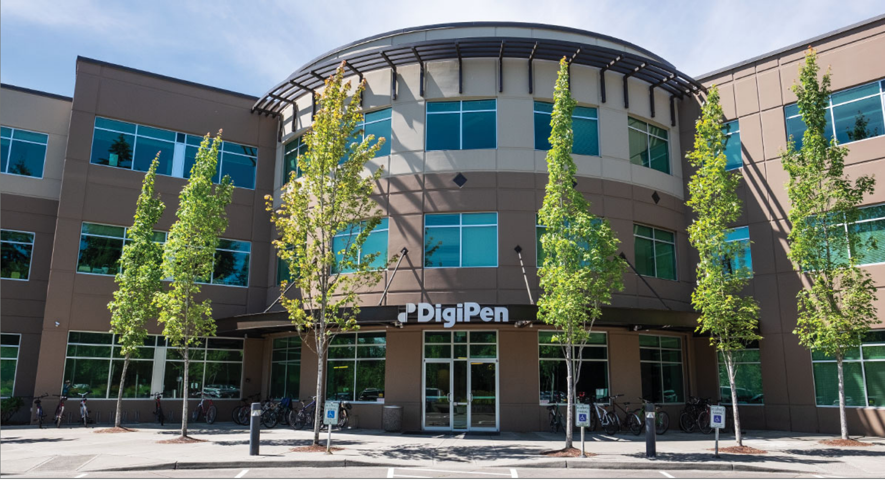
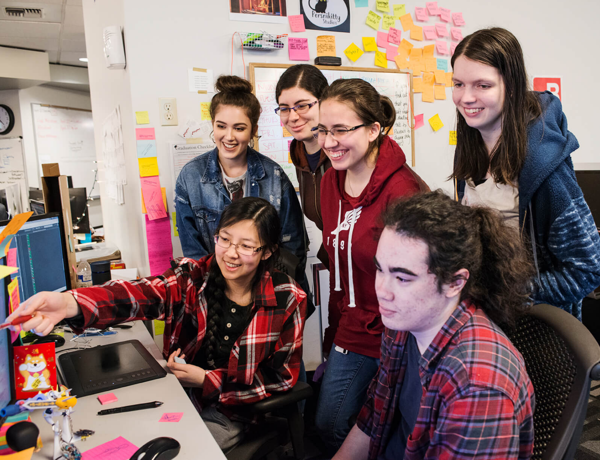
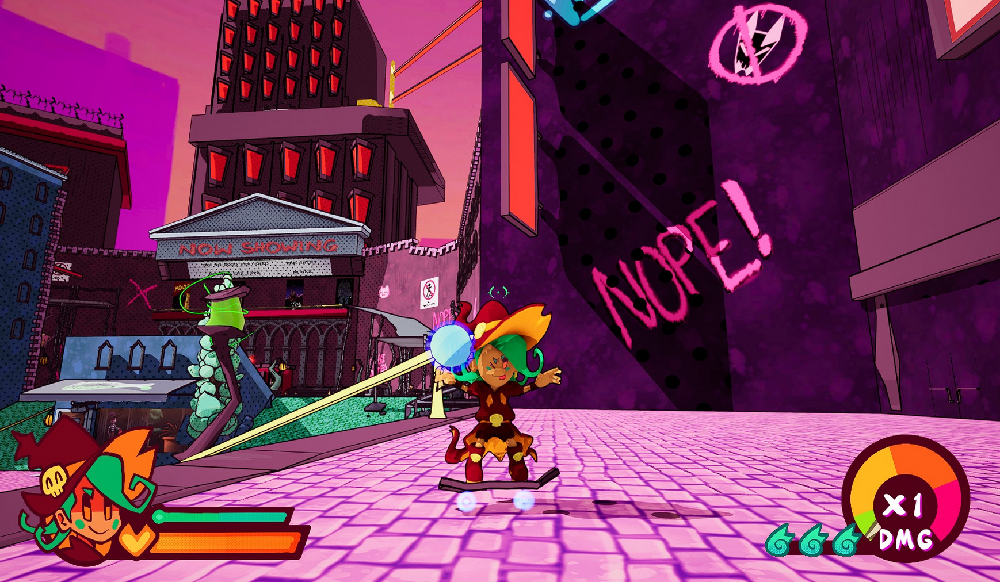
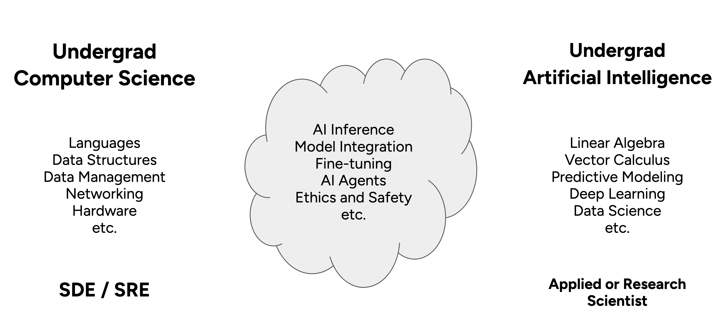
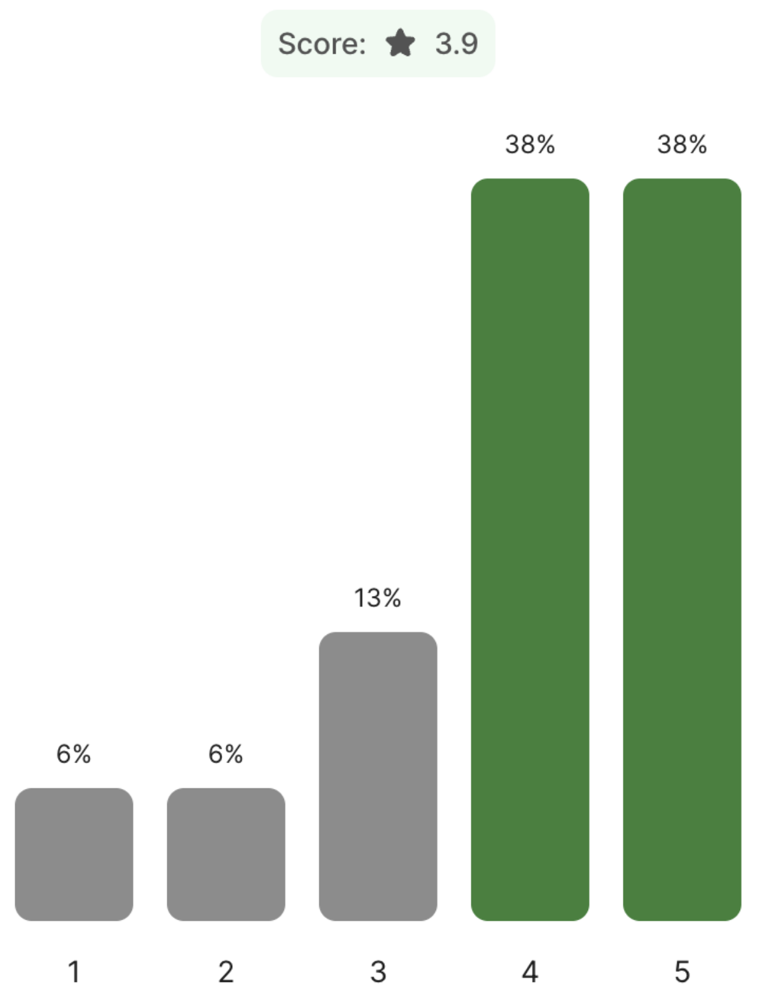
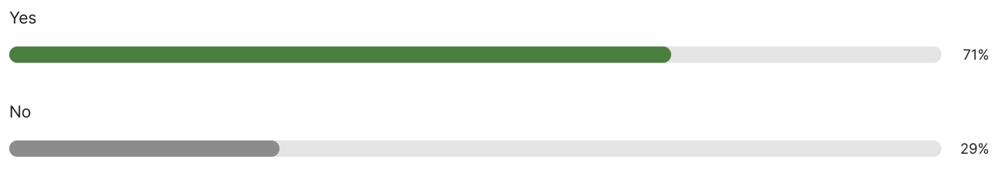
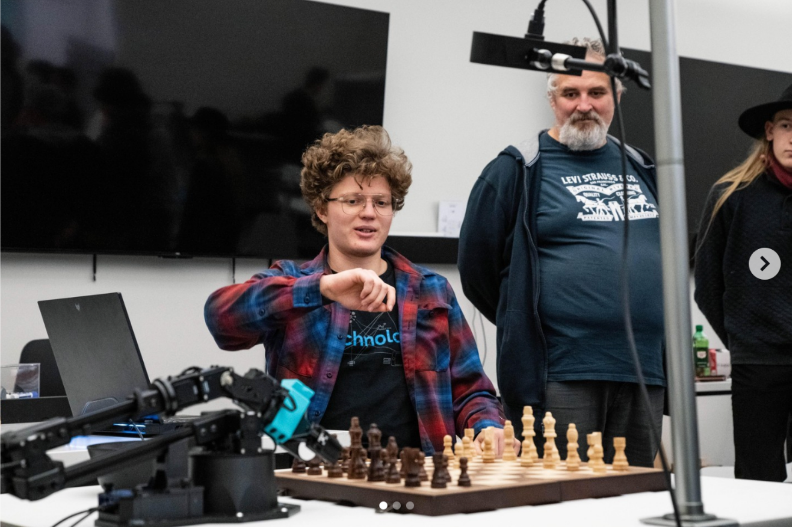

## Agenda

- About DigiPen
- Course Details and Syllabus
- Platform and Tools
- Demo
- Q&A

# About DigiPen

## About DigiPen

::: {.columns}
:::: {.column width="50%"}
- Founded in 1988
- First college in the world to offer a bachelor’s degree in video game technology and development
- Students placed at Microsoft, Amazon, Bungie, EA, and other studios
- Graduates credited on 2150+ commercial game titles
- Rated Top Game Design Programs in 2026 by Princeton Review
::::
:::: {.column width="50%"}
{fig-align="center" width="100%"}
::::
:::

## About DigiPen

::: {.columns}
:::: {.column width="50%"}
{fig-align="center" width="100%"}
::::
:::: {.column width="50%"}
- Undergraduate Degrees in:
  - Computer Science
  - Digital Art and Animation
  - Game Design and Development
  - Music and Audio
- Graduate Degrees in:
  - Computer Science
  - Digital Art and Animation
::::
:::

## About DigiPen

::: {.columns}
:::: {.column width="50%"}
- Computer Science
  - BS in Computer Science
  - BS in Computer Science and Artificial Intelligence
  - MS in Computer Science
- AI-Related Courses
  - ML and AI I & II
  - Deep Learning
  - Computer Science Project
::::
:::: {.column width="50%"}
{fig-align="center" width="100%"}
::::
:::

# Why a New Course on AI?

## “Vacuum” between CS and AI Curriculum

{fig-align="center" width="100%"}

## “Vacuum” between CS and AI Curriculum

{fig-align="center" width="100%"}

## "Inevitability of Local AI"

- A future of open-source SLMs (Small Language Models)
  - Vendor costs are heavily subsidized
  - Open-source models are closing the gap to SOTA (e.g., Qwen3.5-35B-A3B)
  - Quantization keeps getting better (e.g., TurboQuant, Unsloth)
  - Hardware advancements (e.g., Apple MLX, Spark DGX)
  - Data never leaves your machine

# CS-394/594: “How Generative AI Works”

## CS-394 Course Information

::: {.columns}
:::: {.column width="50%"}
- Junior/Senior (300-level) course
- Masters (500-level) option
- 3 credit, 15-week course
- Weeks 1-8
  - Lecture-based with weekly assignments; 40% of grade
- Weeks 9-15
  - Project-based; 60% of grade
::::
:::: {.column width="50%"}
{fig-align="center" width="75%"}
::::
:::

## Learning Outcomes {style="font-size: 0.8em"}

- Understand the basic working principles and history of LLMs
- Create and deploy API-based clients, accessing LLMs hosted by different vendors (OpenAI, Meta, Google)
- Create AI-based agents and tools based on the MCP (Model Context Protocol) specification
- Explore and use multimodal models for image and audio recognition and generation
- Run generative models on local, laptop-based hardware (using CPU, GPU, NPUs)
- Evaluate and test generative models using industry benchmarks
- Avoid hallucinations by increasing the accuracy of models through RAG (Retrieval Augmented Generation) and fine-tuning
- Understand ethical, IP, and safety aspects

# Why Would Students Want This?

## Knowledge Gap

- Students use generative AI today, but few know how it works
  - Current AI curriculum focuses on pre-generative techniques and/or much lower level
- Unanswered questions in game design
  - How do you embed a generative AI model in a game engine as an NPC?
  - What image models could be used to help generate PBR materials in Unity/Unreal?
  - How do audio models work, and could they be used to enhance sound effects?

## Ethical, IP, and Safety Concerns

- Students have a lot of questions/concerns
  - How are today’s models trained?
  - What is the environmental impact?
  - How safe/unsafe are models for consumers?
  - What does generative AI mean for me as a programmer | game designer | artist
  - Is AI going to take my job?
- Goal: Not to take one side or another
  - Provide the constructs and knowledge so that students can reach their own conclusions

## Changing Job Market

- Open positions (non-Tech roles) mentioning AI skills have increased 800% since the launch of ChatGPT [^1]
- 50%+ of tech jobs now require AI skills [^2]
  - An increase of 9800bps over the past 12 months
- Advertised salaries 28% higher (for one AI skill) and 43% higher (for more than one)

[^1]: https://www.cnbc.com/2025/09/04/employers-are-paying-a-premium-for-ai-skills-most-non-tech-jobs.html
[^2]: https://www.dice.com/career-advice/50-of-tech-jobs-now-require-ai-skills-what-this-means-for-your-job-search-in-2026

# Student Feedback

## Student Feedback

- “Test lectures” in Fall 2025 semester
  - Abridged versions of the modules, no hands-on activities
  - “AI Agents”
  - “Generative AI Part 1 (NLP-based models)”
  - “Generative AI Part 2 (Image-based models)”

## Student Feedback (n=17)

::: {.columns}
:::: {.column width="50%"}
What did you think of the test Generative AI lectures?

Did you find the topics useful/valuable?

(1=Not at all; 5=Very)

::::
:::: {.column width="50%"}
{fig-align="center" width="75%"}
::::
:::

## Student Feedback (n=17)

::: {.rows}
:::: {.row height="50%"}
Should DigiPen offer an “Applied Generative AI” course (300-400 level) in the Spring?
::::
:::: {.row height="50%"}
{fig-align="center" width="75%"}
::::
:::

## Student Feedback (n=17)

- If the course was offered, what additional topics would you like to see included?
  - Integrating a local model into a game like Unity
  - AI Ethics and intellectual property
  - Workflow creation
  - How GenAI is being used and implemented in the industry
  - Other applications of the technology beyond creative generation
  - RLHF, Fine Tuning, RAG, other techniques and use cases

# Syllabus Overview (and thoughts on K-12 mapping)

## Week 1: Foundations of Generative AI

- Explore the history of vector embeddings and tokenization 
- Understand the transformer architecture at a high level 
- Use our first transformer to translate language 
- Cover a brief history of early generative transformers 
- Setup and use Colab, and become familiar with the basics of notebooks and Python

## Week 2: Exploring Hosted LLMs

- Understand the evolution and licensing of models from GPT-2 through to modern day 
- Understand instruction-tuned models, how they work, and how to configure 
- Setup and use OpenRouter for accessing hosted models 
- Understand the OpenAI API specification, the request/response payload, parameters, streaming, and structured output 
- Create and share a chatbot using a Gradio-based UI 

## Week 3: Agents and Tools

- Describe the fundamental concepts behind Agents/Agentic AI 
- Explore and provide feedback on an existing multi-agent setup 
- Understand available agent SDKs, how they differ, and advantages/disadvantages 
- Use the OpenAI Agents SDK to build a multi-agent system from scratch, including document indexing and retrieval 
- Understand and implement tool calls and implement using OpenAI’s function calling and via MCP 

## Week 4: Multimodal Models

- Understand the fundamentals and history of diffuser models 
- Explore and use models that demonstrate text-to-image, image-to-image, inpainting, outpainting, and ControlNet
- Setup and use Replicate to create a custom pipeline of production-grade models 
- Understand the fundamentals and history of Vision Encoders and VLMs 
- Implement/test a local VLM model for on-device inference

## Week 5: Running Models on Local Hardware

- Understand the use cases, advantages/disadvantages for running models on local hardware - desktop, web, mobile 
- Understand hardware requirements and architectures for model inference - e.g., CUDA vs. ONNX vs. MLX vs. WebGPU 
- Explore how quantization works and understand techniques and formats for quantizing existing models 
- Use llama.cpp to quantize and run an SLM on local hardware/gaming PC 
- Integrate a quantized model within Unity/Unreal/WebAssembly

## Week 6: Increasing Model Accuracy (Pt 1)

- Understand what leads to hallucinations in models, how models are evaluated, and an overview of techniques to increase accuracy
- Explore prompt engineering and thinking models
- Introduce and implement Text-to-SQL and RAG (Retrieval-Augmented Generation) to increase the accuracy of a limited SLM
- Start exploring model fine-tuning
- Generate synthetic data for fine-tuning a small language model

## Week 7: Increasing Model Accuracy (Pt 2)

- Use generated synthetic data to fine-tune an SLM using QLoRA
- Use W&B (Weights & Biases) to observe metrics during the training run
- Post-training, test and evaluate the accuracy of a fine-tuned model
- Merge, quantize, and upload a model to Hugging Face to share with others
- Create a model card for a newly fine-tuned model

## Week 8: Ethics, IP, and Safety

- Explore ethical, IP, and safety implications, examples, and potential mitigations, connecting back to prior modules
- Discuss each area in depth and share different perspectives as a group
- Research a theme or media claim and author a paper confirming or challenging it

# Final Project

## Weeks 9-15: Final Project

::: {.columns}
:::: {.column width="50%"}
- Students develop and present a final project using concepts learned in the course:
  - Integration of AI Models (10%)
  - Functionality (10%)
  - Innovation and Creativity (10%)
  - Ethical Analysis (10%)
  - Presentation (20%)
::::
:::: {.column width="50%"}
{fig-align="center" width="100%"}
::::
:::

# Platform and Tools

## Platform and Tools

- Quarto (quarto.org) to create curriculum (slides, assignments, resources, etc.):
  - Everything is Markdown; supports LaTex
  - Strong citation/bibliography feature
  - RevealJS for slides
  - Integration with Python and notebooks (e.g., notebook cells can be dynamically embedded within slides)
  - Hosted for students on GitHub pages

## Platform and Tools

- Hands-on exercises and weekly assignments completed using Google Colab
  - Industry-standard toolset
  - Access to GPUs and TPUs for inference and training
  - Model download happens between cloud vendors (vs. the campus network)
  - Easy to share notebooks in-class
  - Generous (free*) GPU limits for students and educators

# Demo

# What's Next?

## What's Next?

- Updating curriculum for next semester
  - New models and techniques
  - Adding dedicated module on audio (TTS, SST, Omni)
- Searching for international guest lecture opportunities
  - Summer timeframe
  - Current undergrad and/or masters CS/AI courses
- Considering "How AI Works for STEM Educators"
  - Condensed version of materials, designed for educators

# Thank You!

