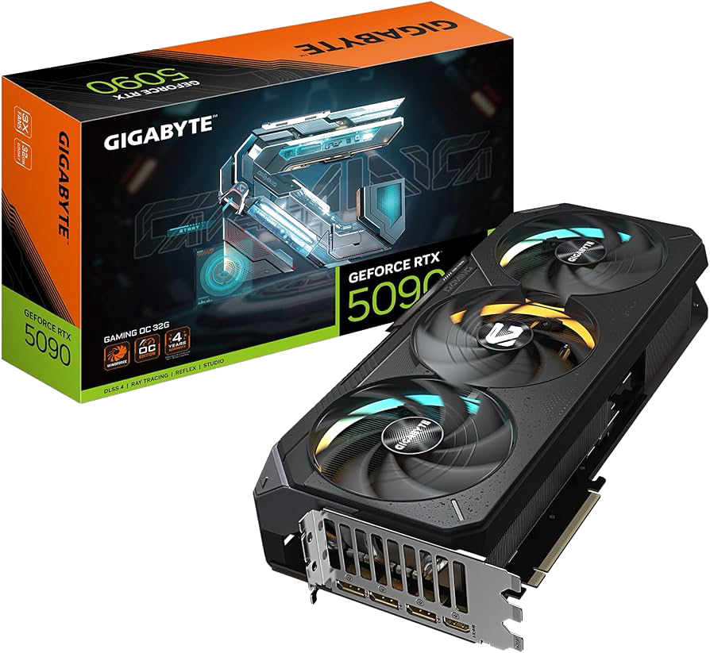
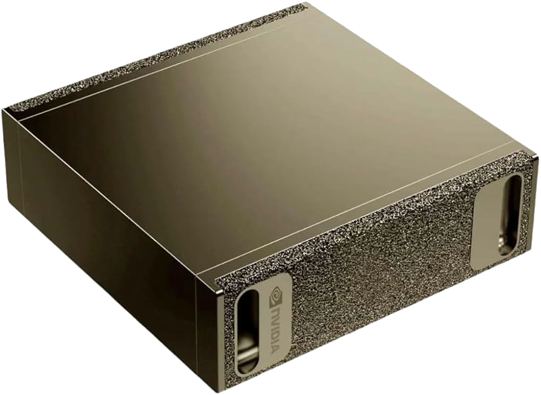
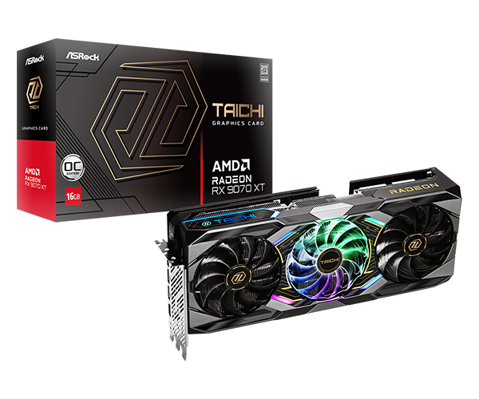
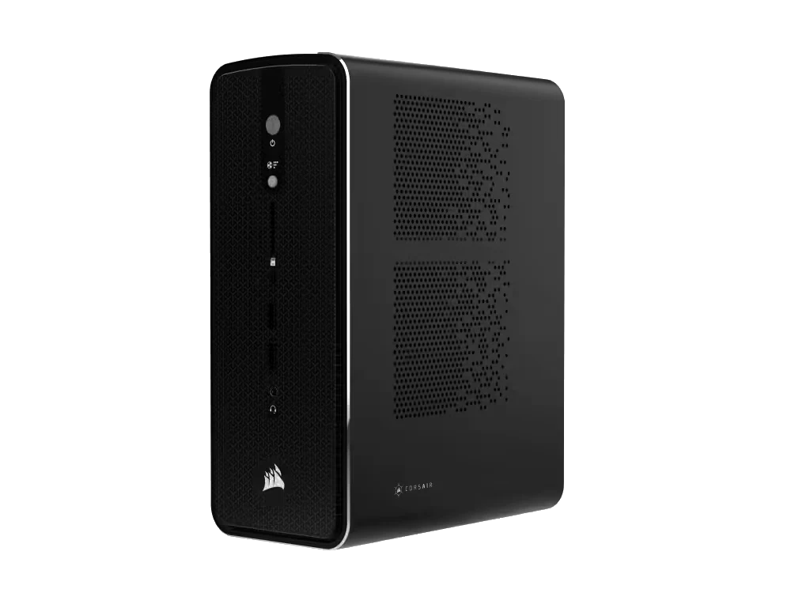
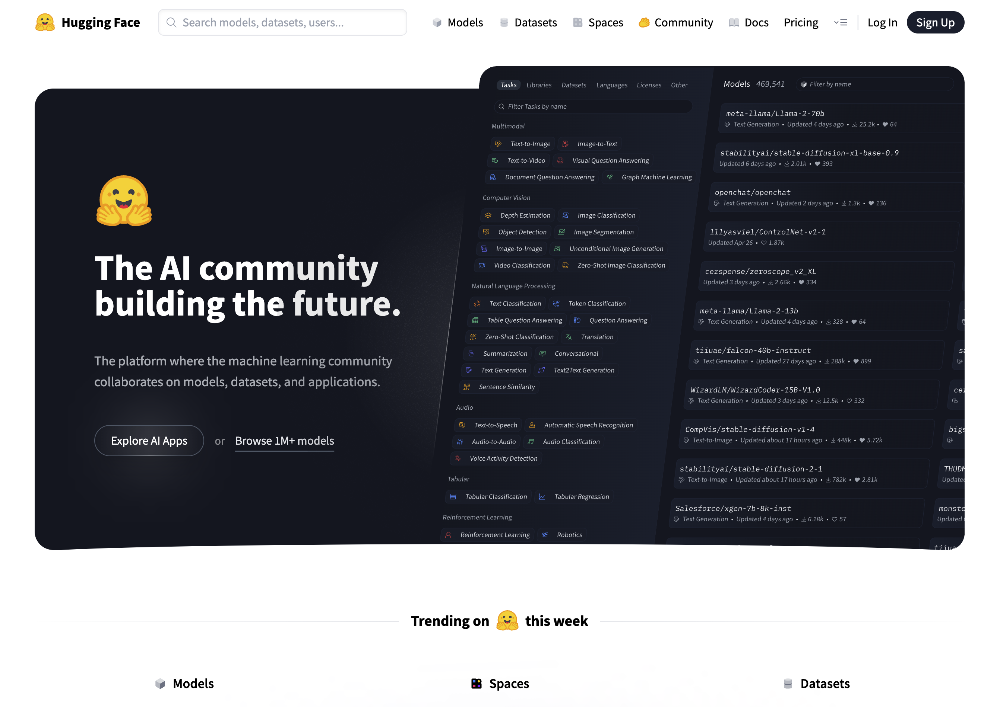

## Learning Objectives

- The case for running AI models locally
- Hardware requirements
- Discovering and running models
- How models are optimized for local hardware
- Benchmarks

# Why Local AI?

## Why Local AI?

- **Privacy**
  - Every call to ChatGPT or Claude may get logged and/or be used for training purposes
  - Many organizations don't want their customer/financial data logged with an AI vendor
  - There may also be legal regulations/restrictions

## Why Local AI?

- **Offline**
  - Every call you make to ChatGPT or Claude needs an Internet connection
  - That's not always guaranteed!
  - e..g, a remote school in India and/or rural districts here in the US

## Why Local AI?

- **Latency**
  - Even with a network connection, calls can suffer from increased latency
  - Especially if your application needs frequent, quick responses
  - e.g., using a VLM on a video stream for a user with vision impairments

## Why Local AI?

- **Cost**
  - While per-API costs are fractions of a cent, these can grow out of control with exponential growth
  - More pronounced for long conversation threads
  - Or agents with verbose tool call requests/responses

# What's Your Hardware?

## What's Your Hardware?

- NVIDIA GPU
- AMD GPU
- Apple Silicon
- NPU (Neural Processing Unit)
- CPU

## NVIDIA CUDA

- CUDA (Compute Unified Device Architecture)
  - Launched in 2006 to introduce programming on GPUs (GPGPUs or General Purpose GPUs)
  - A C-like programming interface
  - Perfectly timed for the deep learning revolution of the 2010s
  - Additional libraries (e.g., cuBLAS, cuDNN) make CUDA the de facto standard today

## NVIDIA CUDA - Hardware Support

::: {.columns}
:::: {.column width="50%"}
- RTX 40- and 50- series cards
- RTX 30- series still used in education
- 8GB - 32GB VRAM
- RTX 40- and 50- series laptops (although thermal throttled)
::::
:::: {.column width="50%"}
{fig-align="center" width="100%"}
::::
:::

## NVIDIA CUDA - Hardware Support

::: {.columns}
:::: {.column width="50%"}
{fig-align="center" width="100%"}
::::
:::: {.column width="50%"}
- **DGX Spark**
  - Launched in 2025
  - NVIDIA GB10 Blackwell GPU
  - 128GB of unified memory
  - 4TB NVMe SSD
  - Well suited for fine-tuning open-source models
  - Multiple vendors (MSI, ASUS, DELL)
::::
:::

## **Sidebar:** TOPS

- **TOPS (Tera Operations Per Second)**
  - How many trillion operations a GPU can perform per second
  - Often qualified with the data type
  - 64 INT8 TOPS == 64 trillion 8-bit operations per second

## AMD ROCm

- ROCm (Radeon Open Compute)
  - Launched in 2016 as an open-source alternative to CUDA
  - Embraced open standards (e.g., OpenCL), but fragmentation initially hurt adoption
  - Has evolved significantly since (e.g., rocBLAS) although ecosystem gaps compared to CUDA

## AMD ROCm - Hardware Support

::: {.columns}
:::: {.column width="50%"}
- RX70- and 90- series
- 8GB - 32GB VRAM
- Competitive prices compared to NVIDIA RTX
- But limited libraries compared to CUDA
::::
:::: {.column width="50%"}
{fig-align="center" width="100%"}
::::
:::

## AMD ROCm - Hardware Support

::: {.columns}
:::: {.column width="50%"}
{fig-align="center" width="100%"}
::::
:::: {.column width="50%"}
- **Strix Halo**
  - Competitor to DGX Spark
  - RX8060S and 128GB unified memory
  - Price competitive
  - Multiple vendors (HP, Corsair, Xiaomi)
::::
:::

## Apple Silicon

- **Metal**
  - Released in 2014, low-level graphics and compute API
- **MPS (Metal Performance Shaders)** 
  - Provides primitives for neural networks
  - PyTorch added device support for MPS in 2022
- **MLX** 
  - Providing NumPy-like API for Apple Silicon hardware

## Apple Silicon - Hardware Support

::: {.columns}
:::: {.column width="50%"}
- Available on all M-series hardware
- Unified memory by default
- Up to 128GB on laptops and 512GB for the Mac Studio
- Non-portable models (MLX format)
::::
:::: {.column width="50%"}
{fig-align="center" width="100%"} 
::::
:::

## **Sidebar:** Unified Memory

- GPUs have historically had separate memory (VRAM)
- Unified memory is shared between CPU and GPU
  - Apple uses SoC (System on a Chip)
  - NVIDIA DGX Spark connected via NVLink-C2C
- Higher memory availability, but lower memory bandwidth
  - 128GB at ~275GB/s for Spark/MLX
  - 32GB at ~1.7TB/s for DTX 5090

## NPUs (Neural Processing Units)

- Specialized AI accelerators, designed for lower power devices
  - Smartphones, IoT, embedded systems
- Optimized specifically for NN operations (e.g., matmul, convolutions, activations)
- 15-80 TOPS common for NPUs (~10x less than desktop PCI-based GPUs)

# Discovering Open-Source Models

## Closed vs. Open-Source Models

- **Closed Source:** 
  - OpenAI GPT-5, Claude Sonnet/Opus, Google's Gemini
  - Very large models; often referred to as **foundational** models or **frontier** models
  - Hosted by the vendors
  - No ability to download the models
  - No ability to inspect the weights of the models

## Closed vs. Open-Source Models

- **Open Weight:** 
  - Meta's Llama, Google's Gemma, Alibaba's Qwen, OpenAI gpt-oss-120b 
  - Range from small to medium in size (1Gb - 500Gb+)
  - Downloadable model files
  - Model files are pre-trained weights, but no training data
  - No training data == No ability to recreate the model from scratch

## Closed vs. Open-Source Models

- **Open Source:** 
  - You can download the model files with pre-trained weights **and** the training data used to train it
  - i.e., you could create the model from scratch
  - Examples: AI2's OLMo, NVIDIA Nemotron

## Discovering Open-Source Models

## What is Hugging Face?

- It is to AI models what GitHub is to source code
  - Explore, download models to run on local hardware
  - Upload and share your own trained/fine-tuned models and datasets
  - Create "Spaces" - hosted web-based apps for accessing models

# Demo

Exploring [google/gemma-3-27b-it](https://huggingface.co/google/gemma-3-27b-it){.external target="_blank"} on Hugging Face

# Introducing Quantization

## Introducing Quantization

- Roughly speaking, the size of the model file dictates how much VRAM (or unified memory) you need
  - 55Gb model ~= 55Gb of VRAM
- What if we don't have that much?

## Introducing Quantization

- Two ways to shrink a model:
  - Reduce the number of weights
  - Reduce the precision of the weights (quantization)
- Number of weights matters more than precision
  - A 70B model at 4-bit will often beat a 13B model at 32-bit
  - The model's knowledge remains largely intact

## Let's Visualize This!

{fig-align="center" width="900px"}

## Let's Visualize This!

{fig-align="center" width="900px"}

## Let's Visualize This!

{fig-align="center" width="900px"}

## Let's Visualize This!

{fig-align="center" width="900px"}

## Let's Visualize This!

{fig-align="center" width="900px"}

## Let's Visualize This!

{fig-align="center" width="900px"}

## Let's Visualize This!

{fig-align="center" width="900px"}

## Let's Visualize This!

{fig-align="center" width="900px"}

## Let's Visualize This!

{fig-align="center" width="900px"}

## Let's Visualize This!

{fig-align="center" width="900px"}

## Quantization Formats

- GGUF (GPT-Generated Unified Format):
  - Runs on all platforms (NVIDIA, AMD, Apple)
  - unsloth community on HF hosts quantized versions of popular models
  - Multiple quantization schemes (Q4_K_M, Q5_K_S, Q6_K, etc.)

## Quantization Formats

- MLX:
  - Apple-only
  - Offers better performance on Mac (compared to GGUF)
  - mlx-community on HF hosts MLX-quantized versions of popular models
  - 4bit and 8bit support

# Demo

Exploring [unsloth/gemma-3-27b-it-GGUF](https://huggingface.co/unsloth/gemma-3-27b-it-GGUF){.external target="_blank"} and [mlx-community/gemma-3-27b-it-qat-4bit](https://huggingface.co/mlx-community/gemma-3-27b-it-qat-4bit){.external target="_blank"} on Hugging Face

# Running GGUF and MLX Models

## Introducing llama.cpp

- [https://github.com/ggml-org/llama.cpp](https://github.com/ggml-org/llama.cpp){.external target="_blank"}
- C/C++ library; download (brew, nix, winget) or compile from source
- Initially just a CLI, but now ships with Web UI and OpenAI API compatible server
- Can reference a locally downloaded .gguf file or pull one from HF

## llama.cpp Wrappers

- LM Studio (https://lmstudio.ai)
  - Desktop GUI wrapper around llama.cpp
  - Supports browsing/downloading of models from HF - i.e., "iTunes for LLMs"
  - In-built chat interface and API server

# Demo

Browsing, downloading, and running Gemma3-27B on LM Studio

# Other Models

## Other Models

- Local models are not limited to text generation
  - **Image Models**: 
    - Image generation models tend to be large
    - Many VLM (Vision Language Models) work well offline
  - **Audio Models**:
    - ASR (Automatic Speech Recognition)
    - TTS (Text-To-Speech)

# Demo

Vision Processing using local Gemma3-27B

# Demo

A local Qwen TTS model working alongside Gemma3-27B

# How About Coding?

## How About Coding?

- **OpenCode** is an open-source, terminal-based AI coding agent
  - Runs entirely locally using any OpenAI-compatible API server (e.g., LM Studio)
  - Reads and edits files, runs shell commands, and iterates on code
- **Model-agnostic** Swap in any local model (Qwen, DeepSeek, Llama, etc.) via a config file

## **Sidebar:** Compute Challenge

- Local GPUs significantly slower than datacenter-class GPUs
- 4060 Ti (~350 TOPS) vs. H100 (~3500+ TOPS)
- One local GPU vs. interconnected datacenter-class GPUs (using NVLink)
- Less TOPS = slower inference (tokens/second)

## Introducing MoE (Mixture of Experts)

- Original concept dates back to 1991. Jacobs et al. publish "Adaptive Mixture of Local Experts" [@jacobs1991adaptive] showing subnetworks and a gating mechanism
- 2023: Mixtral 8x7B (Mistral AI) brings high-quality open-source MoE to the mainstream, becoming a standard architecture for efficient large-scale models

## How MoE Works

- Multiple layers contain multiple experts
- Routing layer is trained to route tokens to the expert best suited to decode
- The experts are "activated" for each token
- 30B model with 3B active
- Reduces latency of generating tokens, especially for larger models

# Demo

Exploring [Qwen/Qwen3.5-35B-A3B-GGUF](https://huggingface.co/unsloth/Qwen3.5-35B-A3B-GGUF){.external target="_blank"} on Hugging Face

# Demo

Running OpenCode with Qwen3.5-35B-A3B local model

# Benchmarks

## Qwen3.5 vs Frontier Models

| Benchmark | Qwen3.5-27B | GPT-5-mini | GPT-OSS-120B |
|---|---|---|---|
| MMLU-Pro | 86.1% | 83.7% | 80.8% |
| GPQA Diamond | **85.5%** | 82.8% | 80.1% |
| SWE-bench Verified | **72.4%** | 72.0% | 62.0% |
| LiveCodeBench v6 | 80.7% | 80.5% | **82.7%** |

## Gemma 4 vs Frontier Models

| Benchmark | Gemma 4 31B | Gemini 2.5 Pro | Claude 4 Opus |
|---|---|---|---|
| MMLU-Pro | 85.2% | — | — |
| GPQA Diamond | **84.3%** | **86.4%** | 79.6% |
| LiveCodeBench v6 | 80.0% | 72.5% | 48.9% |
| AIME 2026 | 89.2% | — | — |

## Qwen3 Coding vs SOTA (SWE-bench)

| Model | SWE-bench Verified | Open? |
|---|---|---|
| Claude Opus 4.5 | 77.8% | No |
| Qwen3.5-27B | 72.4% | Yes |
| Claude Sonnet 4 | 70.4% | No |
| Qwen3-Coder (480B) | 69.6% | Yes |
| GPT-OSS-120B | 62.0% | Partially |

## Conclusion

- The case for running AI models locally
- Hardware requirements
- Discovering and running models
- Optimizing models for running locally
- Benchmarks

# Thank you!

# Bibliography

## Bibliography