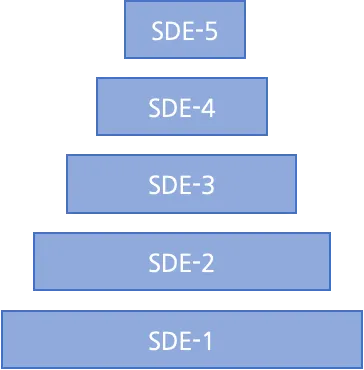
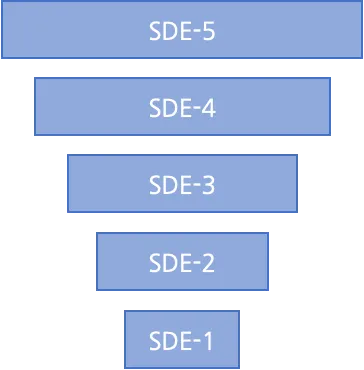
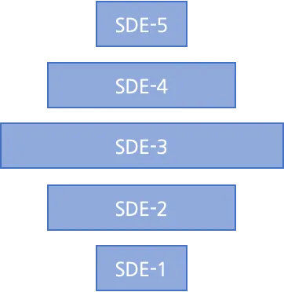
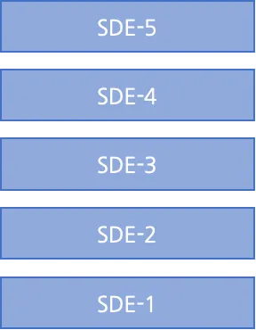
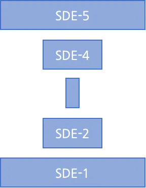
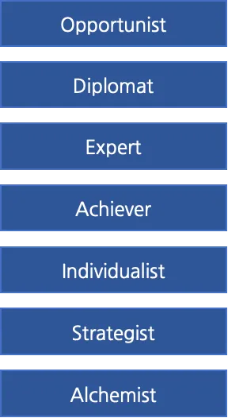

## Introduction

- **Simon Guest**
- 25+ Years Shipping Software, including:
  - 10 Years at Microsoft (Developer Division)
  - 4 Years at Amazon (AWS and Transportation)
  - 4 Years at SAP Concur (Travel and Expense)
  - 3 Years at Neudesic/IBM (Mobile App Development)
- Advisor to Tola Capital (VC Firm in Seattle)
- Former Chief Technology Officer at Code.org
- Adjunct Professor of AI at DigiPen Institute of Technology

## Generative AI in the US: Current Trends

- Majority of VC Investment
  - IPOs on the horizon: OpenAI, Anthropic, Perplexity
- Three Trends:
  - Measuring Productivity of AI Tools
  - "Token maxxing" and cost
  - "Moat protection" for startups
- Backdrop of Layoffs
  - AI vs. Over-hiring/ZIR

## Agenda

- **Lessons from Microsoft, Amazon, SAP, and IBM**
  - Team and Organization Design
    - *"What roles might change?"*
    - *"How do we overcome organizational resistance to AI?"*
  - Shipping Features
    - *"Can we ship quicker with AI?"*
    - *"Should we all be vibe coding now?"*
  - Dealing With Technical Debt
    - *"Can AI help us reduce this?"*
    - *"How do we avoid creating more with AI?"*

# Discussion Encouraged!

# Team and Organization Design

## Shape of Your Engineering Team

- Every team has a "shape"
- Ratio of engineers at each level
  - Junior SDE-1 through Senior SDE-5
- **Five shapes:** Triangle, Inverted Triangle, Diamond, Rectangle, and Hourglass

## Triangle

::: {.columns}
:::: {.column width="50%"}
- Common in product teams at large organizations (Microsoft, Amazon) who run internship programs
- Well suited for established products with operational load
- Good for mentoring opportunities
- **Watch out for** burnout at SDE-5
::::
:::: {.column width="50%"}
{fig-align="center" width="100%"}
::::
:::

## Inverted Triangle

::: {.columns}
:::: {.column width="50%"}
- Less common, but effective for early-stage startups and new product development
- Used this model for building hardware device at Amazon
- Strong team with senior and principal level engineers
- **Watch out for** gaining consensus given the team's seniority
::::
:::: {.column width="50%"}
{fig-align="center" width="100%"}
::::
:::

## Diamond

::: {.columns}
:::: {.column width="50%"}
- Sometimes found in organizations who did college hiring/interships in the past
- I inherited several "diamond-shaped" teams when I started at Code.org
- Can still be effective for well-established products
- **Watch out for** the width of the diamond - i.e., too many mid-level engineers looking for large projects/promotions
::::
:::: {.column width="50%"}
{fig-align="center" width="100%"}
::::
:::

## Rectangle

::: {.columns}
:::: {.column width="50%"}
- Often found in small to medium sized organizations
- Good balance of feature development for engineers at all levels
- Steady mentoring opportunities and growth
- **Watch out for** bringing on too many interns / moving to triangle
::::
:::: {.column width="50%"}
{fig-align="center" width="80%"}
::::
:::

## Hourglass

::: {.columns}
:::: {.column width="50%"}
- Seniors and Juniors, but few mid-level engineers - sometimes "air-gapped"
- Rare. I've only come across one or two in my career.
- Form when inverted triangle team's move on to v2 of a product and bring on interns for support
- **Watch out for** disconnects between senior and junior levels in the team
::::
:::: {.column width="50%"}
{fig-align="center" width="80%"}
::::
:::

## "With AI, Do We Need Junior Engineers?"

- With AI (and layoffs) many organizations have cut back on internships/hiring junior engineers
  - Team "shapes" thin out at the bottom, becoming inverted triangles
  - What used to be handled by an intern, now required of a SDE-3 = potential job dissat

## "With AI, Do We Need Junior Engineers?"

- Yes, we still need junior engineers
- But, their function changes - e.g., no longer doing basic website changes
- And, the expectation of their qualifications increases
- Examples from recent DigiPen graduates

## "Should We Create a Dedicated AI Team?"

- Historically, AI (Data Science) has often been a separate team or division
- At Concur, completely separate organizational structure
- "This ship has sailed"
- AI has to be an integral part of each team now
- Training and education of the team is critical to this

## Overcoming Resistance to AI

- AI becoming an integral part of the team will often meet resistance
  - "I'm concerned about my job security"
  - "The quality of Claude Code is not high enough for me"
  - "I'm against AI because of safety/environmental/anti big-tech"
- Forcing the issue can be challenging, especially for valued employees with long tenure
- Moving to non-AI projects is only a temporary solution

## Overcoming Resistance to AI

- Support engineers with free tools/credits/GPUs - remove the barrier for trying out AI tools
  - A monthly stipend can work well
- Identify the champions in the organization
  - Often resistance breaks down easier from peers vs. managers
- Create group-based education opportunities
  - Internal AI Hackathons can works wonders

# Q&A

# Shipping The Right Features

## Document-Driven Culture

- Amazon has a unique culture (they call it "peculiar"!)
- One of the traits of the culture is a ban on PowerPoint slides
- Instead, they have a document-driven culture
- Decisions are made with 2 or 6-page documents, printed on paper, and reviewed in silence in meetings

## Document-Driven Culture

- A document-driven culture can be very effective:
  - Deeper thinking ahead of proposing an idea
  - Increased employee engagement through reading vs. listening
  - Get input from everyone in the room
  - Resolute decision making
  - Historical knowledge of decisions

## Document-Driven Culture

- Used for everything: 2/6-pagers, PRFAQ, OP1/OP2, Promotion Justifications
- Opinionated vs. seeking consensus
- Writing style is incredibly important
- Explicit reading rituals. No pre-reads. 90-120 mins for 6-pager.
- But, quick decision making vs. follow up meetings.

## Document-Driven Culture

- But does this still hold true with AI?...

## Prototype-Driven Culture

- Slow-shift towards "prototype-driven culture"
- Instead of a document, a usable product is created/tested
- Also has benefit of immediate customer feedback (play-testing)
- IMO, a combination of both can be very powerful
- A document still holds weight for financial projections, GTM strategy, input from others

## So Managers Should Code Now? :)

- Polarizing question, especially at the CTO level
- I've struggled with personally for many years
- *How can I keep up to date technically by writing code, but not dis-empower my team?*

## So Managers Should Code Now? :)

::: {.columns}
:::: {.column width="50%"}
- At Microsoft/Amazon, I solved this via an action logic framework
- HBR research from a multi-year survey on leadership styles
- Seven layers of action logic: How leaders interpret their surroundings and react when their power of safety is challenged
::::
:::: {.column width="50%"}
{fig-align="center" width="60%"}
::::
:::

## So Managers Should Code Now? :)

::: {.columns}
:::: {.column width="50%"}
- Many managers write code as the **expert**
- This is their comfort zone, especially if they are newly promoted
- But this always backfires
- Introduces an awkward power dynamic (my manager wrote this, but it's not very good)
- Often takes away opportunities from engineers
::::
:::: {.column width="50%"}
{fig-align="center" width="60%"}
::::
:::

## So Managers Should Code Now? :)

::: {.columns}
:::: {.column width="50%"}
- Don't be the expert!
- The right level to write code at is the **strategist**
- Use your code to set a vision or direction
- *I had an idea how we can solve X. I’ve put together a quick prototype that shows the potential. What do you think?*
- If you are successful, the team will adopt the idea
- But probably not use your prototype code - which is fine!
::::
:::: {.column width="50%"}
{fig-align="center" width="60%"}
::::
:::

# Q&A

# Dealing With Technical Debt

## The Curse of Technical Debt

- Everyone has technical debt!
- Can creep in from day 1
  - I inherited a team in AWS with a ton of technical debt - and they were only 6 months old!
- What causes it? Seven things

## 1. Moving Too Quickly

- Valuing speed-to-market beyond anything else
- Shortcuts are taken in the codebase...
- ...with a promise to fix them
- ...but that never happens
- Often large entanglement in the codebase that makes it difficult to maintain

## 2. Customer Pivots

- Organizations pivot finding their true customer
- e.g., product designed for doctors actually lands better with young parents
- Product undergoes a pivot to cater for the new audience...
- ...but the codebase still has a ton of doctor/healthcare logic in it
- Simple feature requests can come to a crawl: *"Can we add a new phone number type for all customers?"*

## 3. Departing Engineers

- Engineers Leave. And they take with them the knowledge of the system
- We ask for handover documentation, but it's never enough
- Result is a lack of system understanding across the team, leading to slower velocity
- New engineers can be "afraid to touch the code" in case they break it

## 4. New Engineers (With Differing Experience)

- New engineers join. Congratulations!
- But they have a background/knowledge of a different stack (e.g., Rust/Go vs. Java)
- That's OK - they'll pick it up
- Sometimes they do, and it's great
- But sometimes they don't - leading to a lack of respect and/or wanting to rewrite in a different tech/language

## 5. Lack of Documented Technical Direction

- Engineers learn by looking through the code repo/working with others
- And sometimes by reading documentation
- But this is often not enough and/or out of date
- Without this documentation (and direction from it) inconsistencies can creep in
- Different styles, tools, patterns, etc.

## 6. Technical Decay

- Classic bit rot: Operating systems/frameworks/libraries out of date and never upgraded
- I've also seen many forks of open source libraries not kept up to date
- Many can be EOL; no longer supported or patched
- Complex dependency chains
- Engineer attrition (as they want to be working on the latest frameworks, but can't) 

## 7. Fragile Development Environment

- Few years ago, IDE setups were simple - Windows/IDE/small code base
- Plethora of OS combinations (Mac, Windows, Linux) architectures (x86, ARM), different IDEs (VS Code, Zed)
- Engineers spend valuable time when their environment breaks - and/or helping others
- Can also amplify technical decay as engineers are hesitant to change their own development environment

## Can AI Help Reduce Technical Debt?

- Yes! 
- Especially with the new models/harness advancements over the past 6-12 months.
- It can be very effective in addressing many of the previous points
- How do we start?

## Instrumenting Repos for AI

- Create CLAUDE.md file at the root of your repo
  - Describe the repo, folder structure, conventions, and tools (e.g., how to run/test the code)
  - Claude Code can help you create this!
- Review, and then add all of the anomalies
  - *"If you are in this part of the code base do this"*
- Add "architectural tenets" into the CLAUDE.md file
  - Guardrails for ensuring that coding agents never go off track at the architectural level

## Instrumenting Repos for AI

- For large repos, create skills
  - SKILL.md file and associated templates
  - *"Create a new webpage on our marketing site"*
  - *"Create a new customer type in the database"*
- Common, complex operations that need precise instructions

## Using Coding Agent to Increase Test Coverage

- With CLAUDE.md in place, expand tests and test coverage
- (Coding models are really good at writing tests)
- Create separate skill for running a test
- With expanded tests in place, consider upgrading test framework (Playwright)

## Carve Away at the Debt

- *"What would it take to upgrade React to v18?"*
- *"Can you convert the older Radium components to React?"*
- *"How many components in our customer portal fail to have a11y tags?"*

## Coding Agent Lifecycle

- Lifecycle: Plan, Act, Test,(Abort), Commit, Clear

## Coding Agent Lifecycle

- **Plan**
  - Write the specification for the feature
  - Be descriptive, bullet points help
  - Ask the agent to validate/question the approach
  - *"What questions and/or clarifications do you have?"*
  - Push back on things that seem incorrect

## Coding Agent Lifecycle

- **Act**
  - Once happy with the specification, implement
  - Watch carefully for file changes/updates
  - Correct approach mid-stream
  - *"I think there's a 3rd party library for that..."*

## Coding Agent Lifecycle

- **Test**
  - Test the feature locally / manually
  - Build a complete test suite
  - (Agents are really good at writing tests)
  - Have the agent run it's own tests after the feature

## Coding Agent Lifecycle

- **Abort**
  - Sometimes, things don't work as expected!
  - It can be challenging to fix before exhausting the context window
  - And many coding agents will "spin out of control"
  - `git stash`, clear context (new session), update the feature spec, and restart

## Coding Agent Lifecycle

- **Commit**
  - Before committing to source control, have Claude self-update CLAUDE.md and create skills (if major new functionality)
  - Review CLAUDE.md file often
  - Auto-compact if approaching ~40K

## Coding Agent Lifecycle

- **Clear**
  - Once CLAUDE.md and feature is committed, clear context (`/new` in Claude Code)
  - Analogy: 50 First Dates movie

# Q&A

# Thank you!

