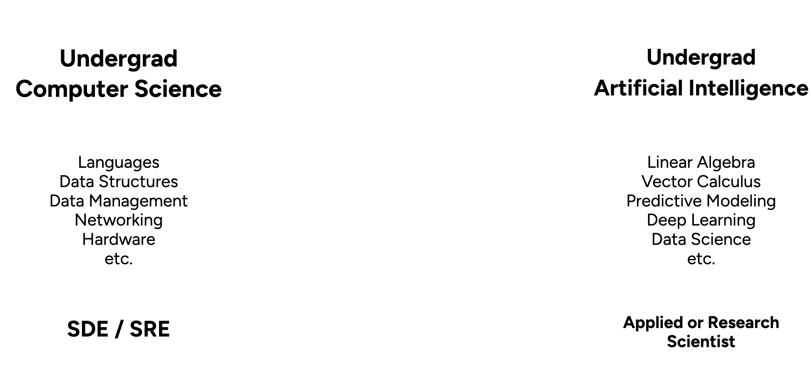
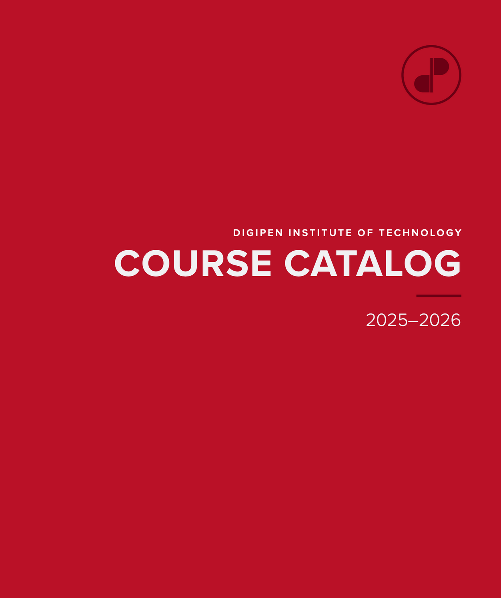
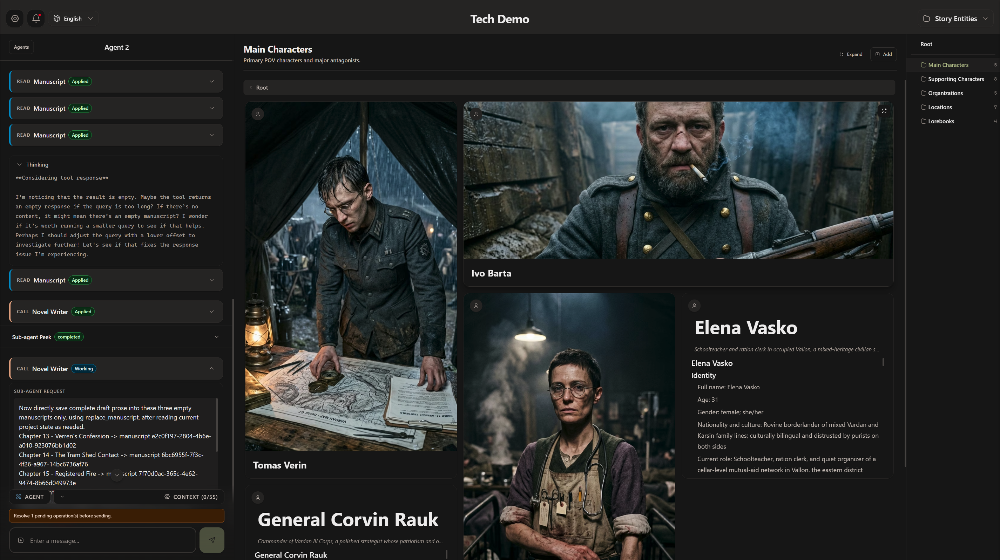

# DigiPenについて

## DigiPenについて

::: {.columns}
:::: {.column width="50%"}
- 1988年設立
- ビデオゲーム技術・開発の学士号を世界で初めて提供した大学
- Microsoft、Amazon、Bungie、EAなどのスタジオに学生を輩出
- 2150以上の商業ゲームタイトルに卒業生が携わっている
- 2026年プリンストン・レビューによるゲームデザインプログラム最高評価
::::
:::: {.column width="50%"}
{fig-align="center" width="100%"}
::::
:::

## DigiPenについて

::: {.columns}
:::: {.column width="50%"}
{fig-align="center" width="100%"}
::::
:::: {.column width="50%"}
- 学士課程：
  - コンピュータサイエンス
  - デジタルアートとアニメーション
  - ゲームデザインと開発
  - 音楽とオーディオ
- 大学院課程：
  - コンピュータサイエンス
  - デジタルアートとアニメーション
::::
:::

# なぜAIの新科目を設けたのか？

<!-- ## CSとAIカリキュラムの間の「空白」

{fig-align="center" width="100%"}

## CSとAIカリキュラムの間の「空白」

{fig-align="center" width="100%"} -->

## ゲームへのAIモデルの組み込み

- ユースケース
  - NPC（ノンプレイヤーキャラクター）の対話とインタラクション
  - スプライトおよびキャラクター変換のための画像モデル
  - ゲームのナレーションとエフェクトのための音声モデル
- OpenAIやGeminiではなく組み込みを選ぶ理由
  - 低レイテンシ、APIコスト不要、データプライバシー
  - 高品質なオープンソースモデル
  - ハードウェアの進歩（例：Apple MLX、ゲーミングハードウェア）

# CS-394/594：「生成AIの仕組み」

## 科目情報

::: {.columns}
:::: {.column width="50%"}
- 3年生・4年生（300レベル）科目
- 修士課程（500レベル）オプションあり
- 3単位、15週間の科目
- 第1〜8週
  - 講義形式、週次課題あり；成績の40%
- 第9〜15週
  - プロジェクト形式；成績の60%
::::
:::: {.column width="50%"}
{fig-align="center" width="75%"}
::::
:::

## シラバス {style="font-size: 0.8em"}

- LLMの動作原理と歴史の理解
- さまざまなベンダーがホストするLLMにアクセスするAPIベースのクライアントの作成とデプロイ
- MCP（モデルコンテキストプロトコル）仕様に基づくエージェントとツールの作成
- 画像・音声の認識および生成モデルの探索と活用
- ローカルのラップトップハードウェア上での生成モデルの実行（CPU、GPU、NPU使用）
- 業界標準のベンチマークを用いた生成モデルの評価とテスト
- ファインチューニングによるモデル精度の向上
- 倫理的・知的財産・安全性の側面の理解

# 学生プロジェクト

## Camp of Light

## Camp of Light



## NovelBuds

## NovelBuds

## OpenCast

## OpenCast



# ありがとうございました！

